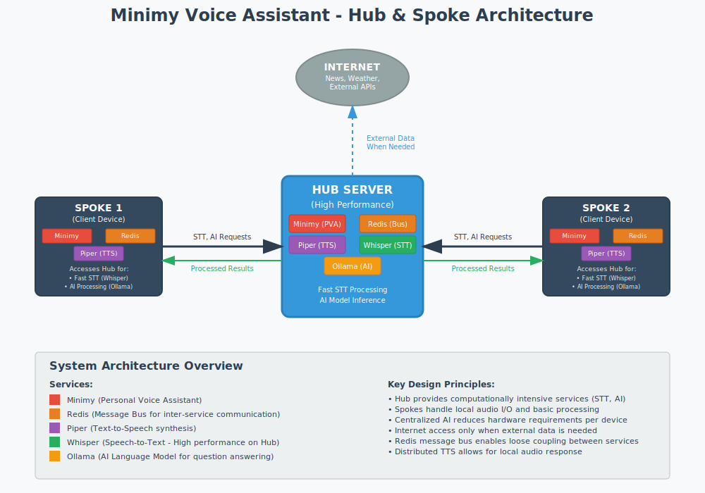
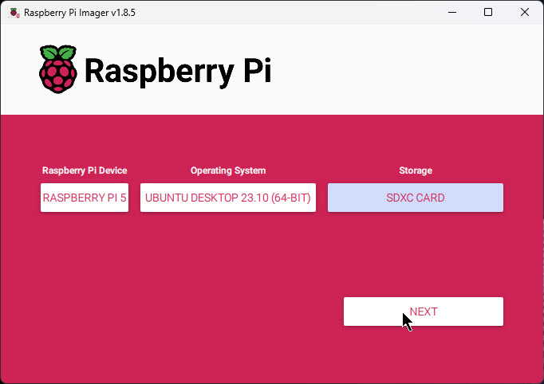
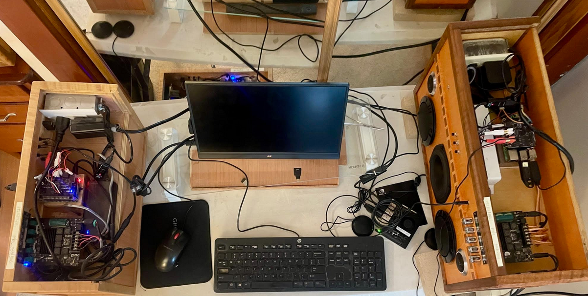

# Minimy  

This is a fork of Ken-Mycroft's code at: https://github.com/ken-mycroft/minimy

## Overview
This code enables a device to play music by voice. 

I worked with Mycroft since 2019, and was able to get a prototype music skill, based on mpc/mpd, working. But the company went bankrupt in 2023, so had to move on. :((  Thanks for all the hard work the Mycroft employees and contributors did to get us this far.

This document describes how to get the solution running, and starts from the very beginning.

Here is a video of a beta version: https://www.youtube.com/watch?v=WRiqg0b-EPI

Following is a block diagram:



The Hub & Spoke model is the idea that one device in the building has to have the best performance to support Speech To Text (STT) and AI general question answering.

The Hub box might be powered by an Nvidia Jetson Nano and the spoke boxes with Raspberry Pi 5's. 

## The build

The environment used to develop the code and write this document is a RasPi 4/4GB and 5/8GB. It was tested with
- Ubuntu Desktop 24.10 
- Rasperry Pi OS Lite, 19 Nov 2024

The overall steps to build a *Smart Boombox* are:

- Acquire the hardware 
- Flash Linux to a memory device
- Connect the hardware
- Install and configure Linux
- Install and use ovos-tools
- Test microphone and speakers
- Install and configure Minimy
- Start Minimy and use it!

## Acquire the hardware
The recommended hardware is a Raspberry Pi (RasPi) 5B with 4 or 8 GB of memory.  

A Rasberry Pi 400 is another option.  It allows the CPU to be *offboard* which frees up space onboard to house batteries. The CPUs also run a lot cooler due to the massive heat sink.

Hopefully the RasPi 5 will be out soon and will be more powerful, run cooler, and be easier to procure.

For a microphone, a flat, disk type with a mute/unmute switch for visible privacy is recommended.  Don't use a cheap one.
It is best to move the microphone away from the speakers and closer to the center of the room.

You can start with just about any speaker(s) with a 3.5mm jack that will plug into the RasPi.  I could start writing about DAC HATs and audio quality, but that's outside the scope of this document.

## Flash Linux to a memory device
The RasPi boots from a micro-SD card that plugs into its underside. A 32 GB card or larger is recommended. You need to *prime the pump* and copy a Linux distribution to it. 

The following Linux distributions have been tested: 
- Ubuntu Desktop 24.10 - https://cdimage.ubuntu.com/releases/24.10/release/ubuntu-24.10-preinstalled-desktop-arm64+raspi.img.xz 
- Raspberry Pi OS Lite - https://downloads.raspberrypi.com/raspios_lite_arm64/images/raspios_lite_arm64-2024-11-19/2024-11-19-raspios-bookworm-arm64-lite.img.xz

You will need another computer (ideally running Linux) to copy the Linux image to the memory card.
To use the image, first uncompress it - the ``.img.xz`` file will become much larger and renamed to ``.img``.

### Prepare on Linux

If you have a Linux box with an SD card port, you can use **``rpi-imager``** to copy the Linux image. To do so, perform the following tasks.
- Put a micro-SD card into an SD adapter.
- Plug the SD adapter into the card reader.
- If you don't have it already, install the tool.

    ```
    sudo apt-get install -y rpi-imager
    ```

- Run the tool.

    ```
    rpi-imager
    ```
    
    You should see a window as shown in the following figure. 



- To flash a Linux image to the card, perform the following steps:

    - Select one of these from *Operating System*.
        - Raspberry Pi OS (64-bit) Debian Bookworm with Desktop
        - Other General Purpose OS => Ubuntu => Desktop 24.10 (64-bit)

    - Select the *Storage* device. You should see just one micro-SD card in the dropdown menu. If you don't see any entry, your SD card has not been recognized.

    - Click **Write**.

    - If you are challenged for credentials, enter the password of the current user.

You should see a progress indicator as the image is copied to the SD card. It should take around 5 minutes.


### Prepare an SD card on Windows
If you only have access to a Windows system Install the *Win 32 disk imager* from https://sourceforge.net/projects/win32diskimager/

There is now a port of **``rpi-imager``** to Windows. See: https://downloads.raspberrypi.org/imager/imager_latest.exe

No further details are provided.

## Connect the hardware

For the initial setup, a keyboard, monitor and mouse are needed. You can access the Internet using either Wi-Fi or with an Ethernet cable.

To connect all the computer hardware, perform the following steps:

- Plug the micro-SD card into the back underside of the RasPi.
- If you have wired ethernet, plug it in to the RJ-45 connector on the RasPi.
- Connect the mouse and keyboard to the USB slots.
- Connect the monitor to the RasPi with an appropriate micro-HDMI cable.  The RasPi 4 two micro HDMI ports - only the left one sends output at boot time.
- If you have a USB drive with music files on it, plug it in to a USB slot.
- Now that all the other hardware is connected, plug the 5v power supply with a USB-C end into the RasPi 4. An official RasPi power supply is recommended to avoid *undervoltage* warnings.  If you have an inline switch, turn it on.

## Install and configure Linux

To install and configure Ubuntu Desktop Linux, perform the following sections.

- Boot the RasPi
- Initial Ubuntu Desktop configuration -or- Initial Raspbian Desktop configuration
- Install the SSH server
- Start a terminal or SSH session
- Update and upgrade your system

### Boot the RasPi

When you supply power to the RasPi, it should start booting.  On the top, back, left side of the RasPi there are two LEDs:

- The LED to the left should glow solid red. This signifies it has 5V DC power.
- The LED to the right should flicker green. This signifies that there is communicaiton with the CPU. If there is a red light, but no green one, it's likely the micro-SD card does not have Linux properly installed.
- You should see a rainbow colored splash screen on the monitor, then the Ubuntu desktop should initialize.

**IMPORTANT**: Never turn the RasPi off without first shutting Linux down with the **``halt``** or similar command. Doing so can damage the operating system and possibly even the RasPi itself.

### Initial Ubuntu Desktop configuration

If you are installing Raspbian, skip to the next section.

A welcome screen should open on the monitor. Perform the following steps:

- On the *Welcome* window, choose your language and click **Continue**.
- On the *Keyboard layout* window, choose your layout and click **Continue**.
- On the *Wireless* window, if you are not using a hard-wired Ethernet, click **Connect** and configure a Wi-Fi network. You must know the network SSID and will probably be prompted for a password.
- On the *Where are you?* window, choose your time zone.
- On the *Who are you?* window, set the following values:
    - Set your name.
    - Set your computer’s name (host name).
    - For a user name and password ``pi`` is recommended as it is documented in the reminder of this document.
    - For the last option, **Log in automatically** is recommended.
    - Click **Continue**.
 - The install process will take a number of minutes configuring and will reboot the computer.
 - When the system finishes rebooting, an *Online Accounts* window should appear. Click **Skip**.
 - Click **Next** at the *Enable Ubuntu Pro* window.
 - Choose an option on the *Help Improve Ubuntu* window and click **Next**.
 - Click **Next** at the *Privacy* window.
 - Click **Done** at the *Ready to go* window.

Ubuntu Desktop 22.04 should now be installed
 
### Initial Raspbian Desktop configuration

If you are installing Ubuntu, skip this section.

To install and configure Raspbian, perform the following steps:

- At the *Welcome to the Raspberry Pi Desktop!* window => click **Next**.
- At the *Set Country* window - choose your country, language and time zone and click **Next**.
- At the *Create User* window - The user name must be ``pi``.
- At the *Set up screen* window - Check the box if you see a black box around the monitor and click **Next**.
- At the *Select WiFi Network* window - choose your network and click **Next**.
    - At the *Enter WiFi Password* window, enter the password and click **Next**.
- At the *Update Software* window - click **Skip** - the upgrade will be done from a terminal session.
- At the *Setup complete* window - click **Done** or **Restart**.

### Setting up the SSH server on Ubuntu

If you are installing Raspbian, skip to the next section.

The secure shell (SSH) server is not installed by default on Ubuntu desktop. Install it so you can access your system remotely. To do so, perform the following steps:

- Open a terminal session by right-clicking the mouse anywhere on the desktop and choosing **Open in Terminal**. You should see a console window open.
- Show the contents of the ``/etc/os-release`` file. 

    ```
    cat /etc/os-release
    ```
    
- Update and upgrade your system which installs the latest code for all installed packages.
    
    ```
    sudo apt-get update
    ```

    ```
    sudo apt-get upgrade -y
    ```

- Install the ``openssh-server`` package, with the following command.  You will be prompted for your password.
    
    ```
    sudo apt-get install -y openssh-server
    ```
    
    ```
    [sudo] password for pi:
    ```

- After it installs **``sshd``** should be running. Verify with the following command:

    ```
    service sshd status
    ```
    
### Setting up the SSH server on Raspbian

If you are installing Ubuntu, skip this section.

The secure shell (SSH) server is installed by default on Raspbian, but not running. 

To start it now, and enable it at boot time, perform the following steps:

- Click the red Raspberry icon in the upper left corner, then in the drop-down menu choose **Accessories** then **Terminal**. 

- From the terminal session, start the SSH server for the current session.

    ```
    systemctl start ssh
    ```

- Set the SSH server to start at boot time.

    ```
    systemctl enable ssh
    ```
    
### Start a terminal or SSH session

You can continue to work from a *terminal session* or you can *SSH in* to your new Linux system.  To SSH in, perform the following steps.

- Get your IP address. You should have either a Wi-Fi (``wlan0``) or a hard-wired (``eth0``) connection. To verify, enter the following command. 

    ```
    ip a 
    1: lo:
    ...
    2: eth0:
    ...
    3: wlan0:
    ...
    inet 192.168.1.229
    ```

SSH as the user ``pi``, if you want to continue from another system. You can use **putty** to SSH in from a Windows box, or just use the **``ssh``** command from a Linux or macOS console.

**IMPORTANT**: Do not run as ``root``. Doing so will almost certainly screw up your system. 
Users other than ``pi`` ideally will work as the environment variable ``$HOME`` is used in scripts, however, this has never been tested.

## Install and use ovos-tools

The **``ovos-tools``** repo has been developed to help with the installation, configuration, use and testing of the free and open personal voice assistants.

To install **``ovos-tools``** perform the following steps:
  
- Install **``git``** and **``vim``** as they are needed shortly.

    ```
    sudo apt-get install -y git vim
    ```
    
- Make **``vim``** the default editor.

    ```
    sudo update-alternatives --install /usr/bin/editor editor /usr/bin/vim 100
    ```
    
- Allow members of the ``sudo`` group to be able to run **``sudo``** commands without a password, by adding **``NOPASSWD:``** to the line near the bottom of the file.

    ```
    sudo visudo
    ```

    ```
    ...
    %sudo   ALL=(ALL:ALL) NOPASSWD: ALL
    ...
    ```

- Clone the **``ovos-tools``** package in the ``pi`` home directory with the following commands:

    ```
    git clone https://github.com/mike99mac/ovos-tools
    ```
    
    ```
    Cloning into 'ovos-tools'...
    ...
    Resolving deltas: 100% (366/366), done.
    ```
    
- Change to the newly installed directory and run the setup script. It will copy scripts to the directory ``/usr/local/sbin`` which is in the default ``PATH``.

    ```
    cd ovos-tools
    ```
    
    ```
    sudo ./setup.sh
    ```
    
    The **``ovos-tools``** repo is now installed.
    
### Further customize 

The script **``install1``**, in the **``ovos-tools``** package you just installed, runs many commands and thus saves typing, time and possible errors.

It performs the following tasks:

- Installs the **``mlocate mpc mpd net-tools pandoc python3 python3-pip python3-rpi.gpio python3.10-venv``** packages
- Sets  **``vim``** to a better color scheme and turns off the annoying auto-indent features
- Adds needed groups to users ``pi`` and ``mpd``
- Copies a ``.bash_profile`` to the user's home directory
- Turns ``default`` and ``vc4`` audio off and does not disable monitor overscan in the Linux boot parameters file.
- Changes a line in the **``rsyslog``** configuration file to prevent *kernel message floods*
- Copies a **``systemctl``** configuration file to mount ``/var/log/`` in a ``tmpfs`` which helps prolong the life of the micro-SD card
- Sets **``pulseaudio``** to start as a system service at boot time, and allows anonymous access so audio services work
- Configures **``mpd``**, the music player daemon, which plays most of the sound
- Turns off **``bluetooth``** as Linux makes connecting to it difficult, while most amplifiers make it easy

To run **``intall1``**, perform the following steps:

- Run the **``install1``** script. 

    ```
    cd
    ```
    
    ```
    install1
    ```

### Test the changes

- Test your environment with the newly installed **``lsenv``** script which reports on many aspects of your Linux system.

    ```
    lsenv
    ```
    
The output should show: 

- Processes with ``minimy`` in their name are not running.
- The Music Playing Daemon, **``mpd``** is not running.
- There is one **``pulseaudio``** process running, but it does not have **``--system``** as a parameter.
- Useful information such as IP address, the CPU temperature, root file system, CPU and memory usage.
- None of the file systems frequently written to are mounted as in-memory ``tmpfs`` file systems.

### Test changes of install1 script
Some of the changes made by **``install1``** will not be realized until boot time. To test this, perform the following steps:

- Reboot your system

    ```
    sudo reboot
    ```
    
- Restart your SSH session when it comes back up.
- Run the same script again to see how the environment has changed.

    ```
    lsenv
    ```
    
You should see three changes:

- The Music Playing Daemon, **``mpd``** is now running.
- The one **``pulseaudio``** process shows a **``--system``** parameter which is vital to audio output working correctly.
- The **``/var/log/``** directory is now an in-memory ``tmpfs`` file system.

## Test microphone and speakers

It is important to know your microphone and speakers are working. 
There are scripts in *ovos-tools* named **``testrecord``** and **``testplay``**. 
They are wrappers around the **``arecord``** and **``aplay``** commands designed to make it easier to test recording audio to a file and playing it back on the speaker(s).

- To test your microphone and speakers, issue the following command then speak for up to five seconds. 

    ```
    testrecord
    ```
    
    ```
    Testing your microphone for 5 seconds - SAY SOMETHING!
    INFO: running command: arecord -r 44100  -f S24_LE -d 5 /tmp/test-mic.wav
    Recording WAVE '/tmp/test-mic.wav' : Signed 24 bit Little Endian, Rate 44100 Hz, Mono
    ...
    ```
    
You should hear your words played back to you. If you do not, you must debug the issues - there's no sense in going forward without a microphone and speaker(s).

At this point your system should have a solid sound and microphone stack running, especially **``mpd``** and **``pulseaudio``**, and all software necessary for the installation of Minimy.

## Install and configure Minimy
If you want to install OVOS instead of Minimy, go here: https://github.com/mike99mac/mycroft-tools/tree/master/ovos

In this section you will perform the following steps:
- Download and copy Minimy
- Install Minimy
- Configure Minimy
- Get a Google API key

### Download and copy Minimy 
It is recommended that you make a second copy of Minimy after you download it.  This way, if you make some changes to the running code, you'll have a reference copy. Also the copy of the code that you run should not have a ``.git/`` directory, thus removing any connection to github.

The new directory ***must*** be named ``minimy``, removing the ``-mike99mac`` suffix, as scripts are coded that way.

To download and copy Minimy, perform the following steps:

- Change to your home directory and clone the repo from github.

    ```
    cd
    ```
    
    ```
    git clone https://github.com/mike99mac/minimy-mike99mac
    ```

- Copy the directory recursively from ``minimy-mike99mac`` to ``minimy``.

    ```
    cp -a minimy-mike99mac minimy
    ```
    
- Remove the ``.git`` directory from the copy.

    ```
    cd minimy
    ```
    
    ```
    rm -fr .git
    ```
    
    Now the code will run and you can work in ``minimy`` and keep ``minimy-mike99mac`` as a reference copy.
    
### Install Minimy    
    
- Run the following script to install Minimy and direct ``stdout`` and ``stderr`` to a file. **TAKE A BREAK?** This step can take up to 15 minutes.
    
    ```
    ./install/installminimy 
    ```
    
    It is recommended that you review the output file, checking for warnings or errors.
    
### Configure Minimy

The system can use local or remote services for speech to text (STT), text to speech (TTS)
and intent matching. Intent matching is accomplished using natutal language processing (NLP) based on
the CMU link parser using a simpe enumerated approach referred to as shallow parsing.

As a result you will be asked during configuration if you would like to use remote or local STT, TTS
and NLP. Unless you have a good reason, for now you should always select local mode (``remote=n``) for NLP.

Remote TTS using polly requires an Amazon ID and key.  If you prefer to not use polly for remote TTS you may 
choose mimic2 from Mycroft which is a free remote TTS alternative. You could also select local only TTS in 
which case mimic3 should work fine.

By deault the system will fallback to local mode if a remote service fails. This will happen
automatically and result in a slower overall response. If the internet is going to be out
often you should probably just select local mode.  The differences are that remote STT is more accurate
and remote TTS sounds better. Both are slower but only slightly when given a reasonable internet
connection. Devices with decent connectivity should use remote for both.

You will also be asked for operating environment.  Currently the options are (p) for piOS, (l) for 
Ubuntu or (m) for the Mycroft MarkII.

Three syllable or more wake words are best. Words like 'computer' or words with distinct sounds like 'expression' (the 'x') or 'kamakazi' (two hard
'k's) will always work better than words like 'hey' or 'Joe'. 

You will also be asked to provide an input device index. If you do not know what this means enter the
value 0. If you would like to see your options you can run 'python framework/tests/list_input_devices.py'.
Remember, if you do not source your virtual environment first, things will not go well for you. 

The ``SVA_BASE_DIR`` and ``PYTHONPATH`` environment variables should set properly in your ``~/.bash_profile``.

- Run the following configuration script. In this example all defaults were accepted by pressing **Enter** for each question (except the log level was set to debug). At the end **y** was entered to save the changes.  
 
    **``./mmconfig.py sa``**
    
    ```
    Advanced Options Selected sa
    ... all defaults taken except debug level ...
    Save Changes?y
    Configuration Updated
      Advanced
        ('CrappyAEC', 'n')
        ('InputDeviceId', '0')
        ('InputLevelControlName', 'Mic')
        ('LogLevel', 'd')
        ('NLP', {'UseRemote': 'n'})
        ('OutputDeviceName', '')
        ('OutputLevelControlName', 'Speaker')
        ('Platform', 'ubuntu')
        ('STT', {'UseRemote': 'y'})
        ('TTS', {'Local': 'm', 'Remote': 'p', 'UseRemote': 'y'})
      Basic
        ('AWSId', '')
        ('AWSKey', '')
        ('BaseDir', '/home/pi/minimy')
        ('GoogleApiKeyPath', 'install/my_google_key.json')
        ('Version', '1.0.4')
        ('WakeWords', ['hey computer', 'computer'])
    ```

## Run Minimy
The scripts **``startminimy``** and **``stopminimy``** are used to start and stop processes. 
Each skill and service run as process and use the message bus or file system to synchronize. 
Their output is written to the ``logs/`` directory under the main install directory. 

- Start Minimy, ensuring it is run from the base directory, as follows.

    ``` 
    startminimy
    ```
    
    
- Run **``lsenv``** again to see how your environment has changed.    

    ```
    lsenv

    Status of minimy:
     -) WARNING: minimy is not running as a service ... checking for processes ...
        Minimy user skills: connectivity email example1 help mpc timedate weather wiki
             System skills: buttons intent media_player mic skill_alarm skill_fallback skill_media skill_volume stt tts
    ---------------------------------------------------------------------------------
    Status of mpd:
     -) mpd is running as a service:
        Active: active (running) since Sat 2023-06-10 10:13:24 EDT; 2h 3min ago
    ---------------------------------------------------------------------------------
    Status of pulseaudio:
     -) pulseaudio is running as a service:
        Active: active (running) since Sat 2023-06-10 10:13:22 EDT; 2h 3min ago
        pulseaudio processes:
        pulse        850       1  2 10:13 ?        00:03:35 /usr/bin/pulseaudio --system --disallow-exit --disallow-module-loading --disable-shm --exit-idle-time=-1
    ---------------------------------------------------------------------------------
         IP address : 192.168.1.148
    CPU temperature : 72C / 161F
      Root fs usage : 18%
          CPU usage : 58%
    Memory usage    :
                     total        used        free      shared  buff/cache   available
      Mem:           3.7Gi       1.8Gi       224Mi        44Mi       1.7Gi       1.7Gi
      Swap:          1.0Gi       4.0Mi       1.0Gi
    tmpfs filesystem?
                          /var/log       Linux logs : yes
              /home/pi/minimy/logs      Minimy logs : yes
               /home/pi/minimy/tmp  Minimy temp dir : yes
    ```
You should see two changes:

- Minimy is now running - the output showing user and system skill processes.
- The two minimy file systems frequently written to are now mounted over in-memory ``tmpfs``'s.

## The buttons process

The smart boombox model with the RasPi on-board has three pushbuttons on the front panel to allow quick access to *previous track*, *pause/resume*, and *next track* operations. If you hold the middle button for more that two seconds, it does a *stop* function, which also clears the music queue.  A new **``buttons``** system skill traps button presses and sends corresponding messages to the bus.

If you want to add buttons to your enclosure, attach them to the following GPIO pins:

    +-----+--------+-------------------------------+
    | Pin | Label  | Description                   |
    |-----|--------|-------------------------------|
    | 9   | GND    | Ground common to all buttons  |
    | 11  | GPIO17 | Previous track                |
    | 13  | GPIO27 | Pause/resume                  |
    | 15  | GPIO22 | Next track                    |
    +-----+--------+-------------------------------+
    
Here is a source of purchasing pushbuttons: https://www.amazon.com/dp/B09C8C53DM  

# Debugging
Maybe everything will work perfectly the first time, and you won't have to debug (but we know how that goes :))

Following are some debugging resources.

- Many, many debug statements have been added to the code.  In most classes, every function has at least one log statement when in debug mode with the class, the function, and the parameters passed. 

- Log files are in ``$HOME/minimy/logs``.  
    - Show the log files.
   
        ```
        cd $HOME/minimy/logs
        ls
        ```
        
        ``intent.log  media_player.log  skills.log  stt.log  tts.log``
   
    - When Minimy is running, you can watch all the log files get populated in real time with the following command:

        **``tail -f *``**
        
- There is an HTML file with JavaScript code that displays the message bus in real time. If you do not have a Web server running, you must view it from the local host.
    - Start a browser on the box you're installing on and point it to ``file:///home/pi/minimy/display/sysmon.html``
    - You should see all messages written to the message bus and the associated data.
      
- The **``sortlogs``** script - merges and sorts all the log files by timestamp and saves them to ``/tmp``. The merged output is often easier to peruse than the individual files.

- The **``stopminimy``** script calls **``sortlogs``** so every time you stop Minimy, there is a new log file copied to ``/tmp/`` which persists across the starting and stopping of Minimy, unlike ``$HOME/minimy/tmp/``.

    ```
    $ stopminimy
    ...
    killing process: pi        952424       1 10 16:25 pts/3    00:00:11 python3 framework/services/input/buttons.py ...
    killing process: pi        952425       1  7 16:25 pts/3    00:00:08 python3 framework/services/input/mic.py ...
    sorted logs saved to: /tmp/logs-2023-07-01-16:27:34
    ```
- There's a ``RELEASE-NOTES.md`` and ``TODO.md`` that show a history of the project and a wish list of things to do.
- Google searches, of course ...
- You can email me at mike99mac at gmail.com - can't promise anything, but I will try.

# Reference
These reference sections follow:
- Vocabulary and examples
- Other Documentation

## Vocabulary and examples

In the samples that follow, (words) in parenthesis are the actual words spoken, while {words} in curly brackets become variables populated with the actual words spoken. When (multiple|words|) are separated by vertical bars, any of those can be spoken, and a trailing vertical bar means that word can be omitted.

### Connectivity skill

Following is the Connectivity skill vocabulary.
 
Following are examples of Connectivity skill requests:

 
### Email skill

Following is the Email skill vocabulary.

```
(compose|create|new|start) email
send email
```

Following are examples of Email skill requests:

- **``start email``**
- ... dialog continues ...
- **``send email``**
 
### Example1 skill

Following is the Example1 skill vocabulary.

``(run|test|execute) example one``
 
Following are examples of Example1 skill requests:
 
- **``run exmple one``**
 
### Help skill

Following is the Help skill vocabulary.

Following are examples of Help skill requests:
 
### MPC skill

The MPC skill can:

- Play from your music library
- Play Internet radio stations
- Play Internet music
- Play NPR news
- Create, delete, manage and play playlists 
- Perform basic player operations 

Following are the vocabularies for the MPC skill:

- Music library vocabulary:
    ```
    play (track|song|title|) {track} by (artist|band|) {artist}
    play (album|record) {album} by (artist|band) {artist}
    play (any|all|my|random|some|) music 
    play (playlist) {playlist}
    play (genre|johnra) {genre}    
    ```

- Internet radio vocabulary:

    ```
    play (the|) radio
    play music (on the|on my|) radio
    play genre {genre} (on the|on my|) radio
    play station {station} (on the|on my|) radio
    play (the|) (radio|) station {station}
    play (the|) radio (from|from country|from the country) {country}
    play (the|) radio (spoken|) (in|in language|in the language) {language}
    play (another|a different|next) (radio|) station
    (different|next) (radio|) station
    ```  
    
- Internet music vocabulary:

    ```
    play (track|artist|album|) {music} (from|on) (the|) internet
    ```
    
- NPR News vocabulary: 

    ```
    play (NPR|the|) news
    ```
    
- Playlist vocabulary:

    ```
    (create|make) playlist {playlist}
    (delete|remove) playlist {playlist}
    add (track|song|title) {track} to playlist {playlist}
    add (album|record) {album} to playlist {playlist}
    (remove|delete) (track|song|title) {track} from playlist {playlist}
    list (my|) playlists
    what playlists (do i have|are there)
    what are (my|the) playlists
    ```  
    
- Basic player commands vocabulary:

    ```
    previous (song|station|title|track|)
    next (song|station|title|track|)
    pause                               # stop music but maintain queue
    resume
    stop                                # stop music and clear queue
    
    increase volume
    decrease volume
    ```

Following are examples of MPC skill's requests:
- Play track one and only by artist adele.
- Play album abbey road
- Play genre blues on the radio
- Play language german on the radio
- Play track stressed out by artist twenty on pilots
- Play npr news
- Play artist the chainsmokers from the Internet

### Timedate skill

Following is the Timedate skill vocabulary:

```
what time (is it|)
what (is|) (today's|) date
what day (of the week|) (is it|)
```

Following are examples of  skill's requests:

- What time is it?
- What is today's date
- What day of the week is it
 
### Weather skill

Following is the Weather skill vocabulary:

```
(what's|what is) (the|) weather (forecast|)
```
 
Following are examples of Weather skill requests:

- What's the weather?

### Wiki skill

The Wiki skill is a fallback skill. As such it does not have a vocabulary

# Local Speech to Text <a name="localstt"></a> 
In late 2024 there was work done on running Speech to Text (STT) locally.

If it takes more than three or four seconds to translate your speech, the personal voice assistant seems quite slow. People are used to responses in less than two seconds, ideally less than a second.

Internet services, such as Google offer STT transcription. In addition to custom hardware, such as tensor processors, audio streams are split into smaller segments and processed in parallel, significantly speeding up transcription.

However, this greatly reduces people's privacy.  Ideally the STT can be performed locally and nothing goes out on the Ineternet.

Three SoC platforms are tested for speed:
- Raspberry Pi 4
- Raspberry Pi 5 
- Nvidia Jetson GPU

The Raspberry Pi's are less than $100.  The Nvidia GPU is about $500.

## Preparing the Nvidia GPU
Getting the Nvidia Jetson Orin Nano working took quite a bit of time.

It does not appear possible to boot conventional ARM Linux images on it.  Rather, the Nvidia *JetPack* has to be used.  I tried Jetpack 6 which was the latest, but it would not boot.  I downgraded and installed it as follows:

- Download Jetpack 5.1.3 from https://developer.nvidia.com/downloads/embedded/l4t/r35\_release\_v5.0/jp513-orin-nano-sd-card-image.zip
- Uncompress it to a ``.img`` file
- Copy the ``.img`` file to a micro SD card
- Plug the card in the GPU
- Boot the GPU

Now the box finally booted.  However, it was running Ubuntu 20.04 which was 4.5 years old at the time.  The Python version was 3.8 which was too old for some packages. The solution was to upgrade the firmware with the following command:

```
sudo apt-get install nvidia-l4t-jetson-orin-nano-qspi-updater
```

With the firmware upgraded, it was finally able to boot Jetpack 6. Here are the steps to upgrade to Jetpack 6:
- Shutdown Linux
- Download Jetpack 6.1 from https://developer.nvidia.com/downloads/embedded/l4t/r36\_release\_v4.0/jp61-orin-nano-sd-card-image.zip
- Uncompress it
- Flash the ``.img`` file to a micro SD card 
- Boot the GPU from the card

Now Ubuntu 22.04 is running which has a Python version of 3.10.12. However,  more care and feeding will be needed to utilize the GPUs.

## Creating virtual environments
Python virtual environments (venvs) are highly recommended for testing and to maintain the integrity of your development environment.

A script to create a venv for the Raspberry Pis is here: https://github.com/mike99mac/minimy-mike99mac/blob/main/mksttvenv 
It creates the venv ``stt_venv`` in your home directory. It must be enabled with:

```
cd
. stt_env/bin/activate
```
You should see a prefix of ``(stt_venv)`` on your command prompt (PS1).

The file ``jfk.wav``, hard-coded in the above code, is an 11 second audio clip of John F Kennedy's famous words at his inaguration: 
"And so my fellow Americans ask not what your country can do for you ask what you can do for your country."

The first two tests were the Raspberry Pi 4 and the Nvidia GPU.  The GPU was only 7 or 8 percent faster.  It seems the 1024 GPU cores were not being utilized.

This code tests whether the GPU cores are working:

```
#!/usr/bin/env python3
import torch
print("CUDA available:", torch.cuda.is_available())
if torch.cuda.is_available():
    print("CUDA device:", torch.cuda.get_device_name(0))
```
Many, many different ways of getting the GPUs enabled were tried. Every time the results were:

```
CUDA available: False
```

Finally a script was written to create a venv for the Nvidia GPU here: https://github.com/mike99mac/minimy-mike99mac/blob/main/mksttvenvgpu 

This script downloads *wheel files* for Python torch, torchaudio and torchvision, then installs them in the venv. Finally the output was good: 

```
CUDA available: True
CUDA device: Orin
```
## Getting STT running locally <a name="localstt"></a> 

The code used to test the performance is below. I believe tracking the elapsed time of just the ``transcribe()`` function is correct. Here's the code:

```
$ cat bldwhisper.py
#!/usr/bin/env python3
import argparse
import numpy as np
import pyaudio
import time
import whisper
import wave

class WhisperTranscriber:
  """ Build whisper for local STT using the base.en model """

  def __init__(self):
    self.model = "base.en"                 # tiny.en and small.en are also possible
    self.parser = argparse.ArgumentParser(description="Transcribe audio using Whisper.")
    self.parser.add_argument("filename", type=str, help="Path to the audio file")
    self.args = self.parser.parse_args()

  def load_model(self):
    print("Loading Whisper model ...")
    self.model = whisper.load_model(self.model)  # Load the quantized model

  def transcribe_audio(self, filename):
    print("transcribe_audio(): loading audio ...")
    audio = whisper.load_audio(filename)
    print("transcribe_audio(): pad or trim audio ...")
    audio = whisper.pad_or_trim(audio)
    print("transcribe_audio(): transcribing audio ...")
    start_time = time.time()
    result = self.model.transcribe(audio, fp16=False)  # transcribe to text
    end_time = time.time()
    et = end_time - start_time
    print("Transcription: ", result["text"])
    print(f"Elapsed time: {et}")

if __name__ == "__main__":

  # Create an instance of the WhisperTranscriber class
  transcriber = WhisperTranscriber()                      # create a singleton
  transcriber.load_model()                                # load the model
  transcriber.transcribe_audio(transcriber.args.filename) # transcribe a file
```

### The results

Here are the performance times on the three "boxes":   


| Platform                | Memory | Python | tiny.en | base.en | small.en |
|-------------------------|--------|--------|---------|---------|----------|
| Raspberry Pi 4          |  4 GB  |  3.11  |  8.0s   |  15.1s  |  75.0s   |
| Raspberry Pi 5          |  8 GB  |  3.11  |  6.5s   |   6.7s  |  21.3s   |
| Nvidia Jetson Orin Nano |  8 GB  |  3.10  |  1.3s   |   0.9s  |   1.7s   |


The best option seems to be the ``base.en`` model running on the Nvidia GPU.

Here's a picture of the three boxes.  The Raspberry Pi 4 on the left and Pi 5 on the right are both in boomboxes for superior sound.  The GPU is to the right of the keyboard. A boombox carcass for it is coming soon...


