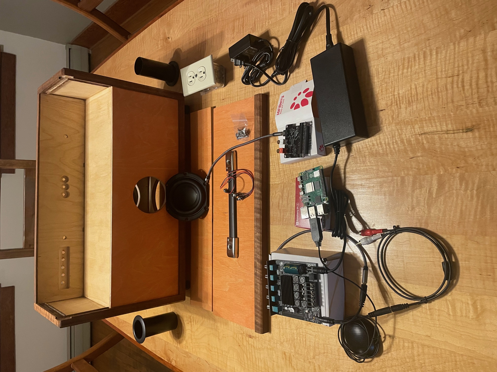
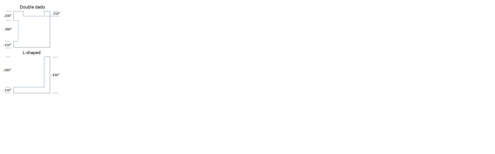
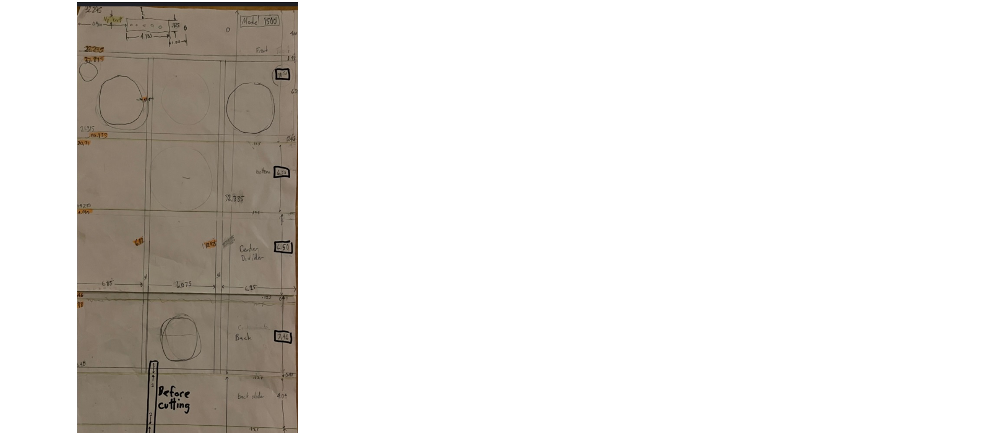
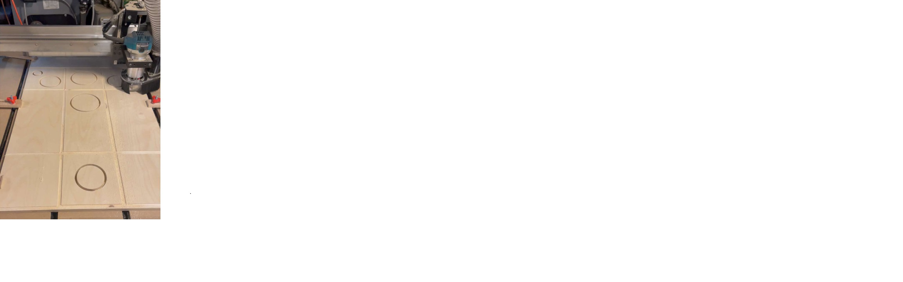

# Overview of a smart boombox
The goal of this project is to create a retro-looking boombox that sounds amazing and can play music by voice. 

This section gives an overview and [Building a smart boombox](#building-a-smart-boombox) gives all the detailed steps.

The picture below shows the front of a boombox carcass assembled and finished, but with no components installed. 
It has three enclosures at the bottom for the left speakers, subwoofer, and right speakers. 
The top third houses the amp, the Raspberry Pi computer and all other components. 
Two removable panels allow easy access to the components. 

It is constructed of 1/2" Baltic birch plywood with hardwood edge moldings. 
The decorative molding in the front is curly maple with cherry inlay. 
The subwoofer is in a sealed enclosure and  *down firing* while the other 5-1/4" device in front is a *passive radiator* - a 
speaker with no electronics. There is also a smaller passive radiator on the back, so the subwoofer 
is driving itself and two other *speakers*. The left and right enclosures are ported. They each have a 4" mid-range speaker 
and 1" tweeter. *Crossover networks* come with the tweeters, so no soldering is required. 
The tweeters really do bring out the highs when compared with “full range drivers”, and of course, the subwoofer 
and friends really bring out the bass.  The left and right enclosures are ported with 1-3/4" diameter ports seen on the sides. 
The subwoofer and mid-ranges are protected with grills, while the passive radiators are unprotected because 
they’re the cheapest to replace and they look kinda cool naked.

There is a 3.5mm headphone jack on the left, and an *aux in* jack on the right. 

Baltic birch has little grain and color, and it just seemed too plain with clear stain. 
An orange stain was tested, but it was too bright and gaudy. Mixing the stain with 
about four parts water turned it into an “orange-wash”, which adds color, brings out the grain, but 
is not overwhelming. After staining, two or three coats of Tung Oil are applied, with sanding between each coat. 

*Front view of boombox carcass and parts*

The next picture shows an amp on the left, a RasPi 5 and a Hifiberry “DAC HAT” to greatly 
improve the audio. Two power supplies are needed: 24V for the amp and 5V for the computer; thus 
the need for an electrical outlet. On the left is a USB microphone. In the center are three 
pushbuttons for previous track, stop/pause, and next track. The amp has an on/off/volume control 
on the right, treble and bass controls in the middle, and subwoofer volume and cutoff frequency 
on the left. You can Bluetooth directly to the amp and bypass the computer.

*Back view of boombox carcass and parts*

# Building a smart boombox
This repo contains the G-Code to build a smart boombox using a CNC machine. 

To build the boombox, perform the following steps: 

- [Obtain all parts and components](#obtain-all-parts-and-components)
- [Download the G-code](#download-the-g-code)
- [Prepare for assembly](#prepare-for-assembly)
- [Perform final assembly](#perform-final-assembly)
- [Install components](#install-components)
- [Stand up the stack](#stand-up-the-stack)

## Obtain all parts and components 
Obtain the follow parts and components:

- [Plywood panels](plywood-panels)
- [Hardwood pieces](#hardwood-pieces)
- [Components](#components)

### Plywood panels
Following 1/2" Baltic birch plywood pieces. The nominal thickness: 0.480". 

| Description                | Qty | Size |
| -----------                | --- | ---- |
| Main panel                 | 1   | 19.875" x 32.295" |
| Side panels                | 2   | 6.005" x 32.295" |
| Internal vertical dividers | 2   | 6.375" x 6.875" **TODO** verify numbers |

The main panel is cut on the CNC machine using two different jobs because the panel is longer than the maximum capacity of 30".
Then it is cut into four smaller panels: the front, the bottom, the lower back and the internal horizontal divider.

### Hardwood pieces 
All hardwood moldings are 0.830" x 0.830". Almost any hardwood can be used. One other piece of wood is needed

| Description               | Qty | Size |
| -----------               | --- | ---- |
| Side tops and bottoms     | 4   | 7.385" |
| Side fronts and backs     | 4   | 11.875" |
| Front and back L moldings | 4   | ~20" (each will be cut to size later) |

One other piece is used to elevate the Raspberry Pi. It is 2.75" wide x 3.625" long.  The thickness must be slightly taller than the power supply for proper access to the Raspberry Pi's power and display ports. Usually 1-1/4" thick is enough, but not always.

Following is a diagram of the side moldings (*Double dado*) and the L-shaped moldings

*Cross section of the two moldings*

### Components  
Following are the components needed, the cost (in Jan 2024) and the source where they were purchased.

| Description                                  | Cost | Source      |
| -----------                                  | ---- | ----------- |
| Raspberry Pi 5: 8GB RAM                      | $80  | www.seeedstudio.com/Raspberry-Pi-5-8GB-p-5810.html |
| RasPi power supply: CanaKit 5V, 3.5A         | $10  | www.amazon.com/gp/product/B01DID1TG4 |
| DAC HAT: Hifiberry DAC2 Pro                  | $45  | www.hifiberry.com/shop/boards/hifiberry-dac2-pro/ |
| MicroSD card: Sandisk 64GB                   |  $7  | www.amazon.com/gp/product/B07XDCZ9J3 |
| 2.1 amplifier: Damgoo 50/50/100W             | $26  | www.amazon.com/gp/product/B089KT3FG9 |
| Amp power supply 24V, 5A: Alitove            | $20  | www.amazon.com/gp/product/B0865LS8XB |
| Pair midrange speakers: Eminence 4"          | $50  | www.parts-express.com/Eminence-Alpha-4-8-4-Full-Range-Pair-8-Ohm-290-4012 |
| Pair tweeters: Skar Audio 1", 320W           | $53  | www.amazon.com/gp/product/B01DID1TG4 |
| Subwoofer: Tang Band 5-1/4"                  | $50  | www.parts-express.com/Tang-Band-W5-1138SMF-5-1-4-Paper-Cone-Subwoofer-Speaker-264-917 |
| Front passive radiator: Dayton Audio 5-1/4"  | $14  | www.parts-express.com/Dayton-Audio-ND140-PR-5-1-4-Aluminum-Cone-Passive-Radiator-290-217 |
| Back passive radiator: Peerless 3-1/2"       |  $8  | www.parts-express.com/Peerless-830878-3-1-2-Passive-Radiator-264-1060 |
| L&R speaker ports: Parts Express 1-3/4" x 4" |  $2  | www.parts-express.com/Port-Tube-1-3-4-ID-x-4-L-260-407 |
| 2 3.5mm male to female: Tan Audio 1Ft        | $12  | www.amazon.com/gp/product/B087CLK6Q5 |
| 2 RCA to 3.5mm cable: Parts Express 3Ft      |  $2  | www.parts-express.com/2-RCA-Male-to-3.5mm-Stereo-Male-Y-Adapter-Cable-with-Gold-Plated-Connectors-3-ft.-240-1018
| 3.5mm Y cable: Parts Express                 |  $2  | www.parts-express.com/3.5mm-Stereo-Male-to-Two-3.5mm-Stereo-Female-Y-Adapter-Cable-with-Gold-Plated-Connectors-3-240-1026 |
| Handle: Penn-Elcomm Wide Strap               |  $6  | www.parts-express.com/Penn-Elcom-H1014K-Extra-Wide-Strap-Handle-Black-End-Caps-262-314 |
| Subwoofer Grill: Parts Express 6"            |  $4  | www.parts-express.com/6-Economy-Speaker-Grill-260-371 |
| pushbuttons: DaierTek Normally Open 10 pack  | $10  | www.amazon.com/gp/product/B09C8C53DM |
| Female to Female jumper wires: GenBasic      |  $6  | www.amazon.com/gp/product/B077N58HFK |
| Pair speaker grills: Facmogu 4"              |  $9  | www.amazon.com/gp/product/B077N58HFK |
| Rubber feet: Parts Express 4-pk, 1" x 1.25"  |  $2  | www.parts-express.com/4-Pack-Rubber-Cabinet-Feet-1-Dia.-x-1.25-H-260-7515|
| USB microphone                               |  $20? | many choices |
| Electrical box, outlet and cover             |  $10? | hardware store |

80+10+45+7+26+20+50+53+14+9+2+12+2+2+6+4+10+6+2+20+10=390

A rough estimate of the cost of the components is $390, so if the wood is $60 or more, the cost for parts is about $450-500.

## Download the G-code
G-code is to a CNC machine what object code is to a computer. It tells the machine what to do, and the machine (hopefully) does it.  
This assumes the wood is the exact same size and aligned in the exact same place.

Because the panel is over 30" (max of my CNC machines), it must be cut twice, rotate 180 degrees between jobs.  
After is the main panel jobs, it is cut on the tablesaw to create four pieces: the front, the bottom, the back and interior divider. 

The following G-code files in this repo are used on a CNC machine to cut out all the pieces.

| G-code file       | Size   | Description |
| -----------       | ----   | -----------
| 4PanelsMainJob.nc | 19.875" wide x 32.295" high | Most cuts on the main panel  |
| faceUpsideDown.nc | 19.875" wide x 32.295" high | Remaining cuts on the top face with panel rotated 180 degrees |
| leftSide.nc       | 7.386" wide x 11.875" high| Cuts on the assembled left side |
| righttSide.nc     | 7.386" wide x 11.875" high| Cuts on the assembled right side |

## Prepare for assembly 
Final assembly of the carcass can take place when you have:
- Four panels prepared
- Two sides assembled

### Cut the main panel
Consider the following rough drawing:

*Rough drawing of main panel and two sliding panels*

Following are the steps to cut the main panel.
- Cut a sheet of Baltic birch into three 19.875" pieces. There should be almost no refuse.
- From one of those, cut a piece 32.395". This is the "main panel" which will later be cut into four pieces.
- Load the Gcode ``4PanelsMainJob.nc``.
- Clamp and square the main panel. 
- Zero XYZ of the main panel.
- Load and run the job to cut the majority of the main panel.
- Rotate the piece 180 degrees and run the job ``faceUpsideDown``. This will cut the holes and recesses at the top of the front panel. 

### Prepare all panels

### Drill holes on face 

After the two jobs are finished on the main panel, 
Always use masking tape on the front face and sharp Forstner bits!

2 holes for jacks:   11/32 (.344")
3 holes for buttons:  9/32 (.281") 
5 holes for amp:     19/64 (.297") 

Distance between each of the 5 knobs on amp: .720"

## Perform final assembly 
### Glue the carcass 
### Enable sliding panels 

To build the boombox, perform the following sections: 192.168.12.239

- [Cut the plywood](#cut-the-plywood)
- [Cut the moldings](#cut-the-moldings)

### Cut the plywood
The width of the boombox was designed around being able to get three panels from a sheet of Baltic birch, 1550mm x 1550mm, or about 60" x 60".

This picture shows the main panel being cut by a CNC machine.

*Main panel being cut*

### Cut the moldings

## Install components 
### Install electrical outlet
### Install amplifier power supply
### Mount Raspberry Pi 
### Install left and right speakers

## Stand up the stack 
The next task that needs to be done is to install the software.  However, that is outside the scope of this document.  TODO: Add a link.

TODO: add pictures of the finished product.
