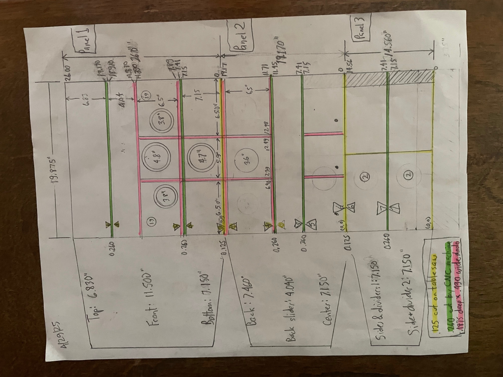
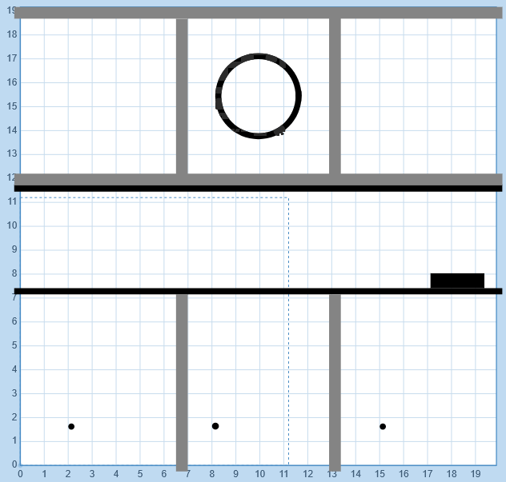
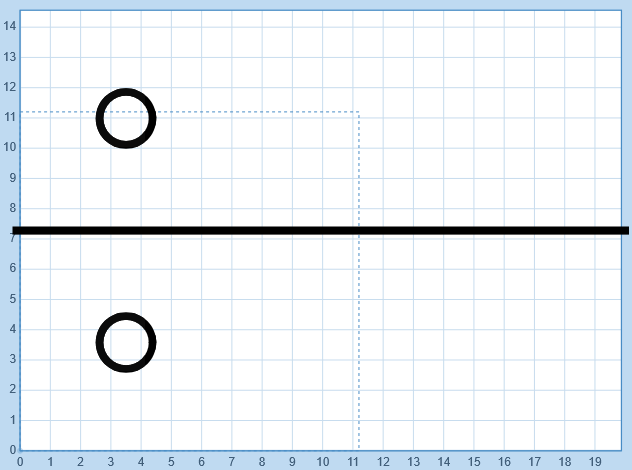

# Overview of a smart boombox
The goal of this project is to:
- Create a beautiful, solid wood, retro-looking boombox, 
- That sounds amazing,
- That can play music by voice, and  
- That respects privacy. 

Dozens of prototypes have led up to this model.

The build is described in excruciating detail, not only for the good of humanity, but also because the author forgets all the steps involved and can never find the scraps of paper with the right notes.

It has three enclosures at the bottom for the left speaker, subwoofer, and right speaker. 
The top is an enclosure for the computer, amplifier and peripherals. 
Two removable panels allow easy access to the components.  It is constructed of: 
- 1/2" Baltic birch plywood, perhaps the best material on earth for speaker enclosures,
- Hardwood edge moldings for contrast and to make the box solid, and
- Decorative molding in the front and sides to give it some character.

The picture below shows the front of a boombox carcase assembled and finished, but with no components installed. 

The subwoofer in the center is in a sealed enclosure and *down firing* while *passive radiators* (speakers with no electronics) are on the front and back. So the subwoofer is effectively driving three speakers. 

The left and right enclosures are ported. They each have a 4" mid-range speaker, a 1" tweeter and a 1-3/4" x 4" plastic port on the sides. *Crossover networks* come with the tweeters, so no soldering is required. 

The inside dimensions of the enclosures are as follows:

|Enclosure        | Inside dimensions     | Cubic in | Cubic ft |
|---------        | -----------------     | -------- | -------- |
|Left and Right   | 6.125" x 6.77" x 6.5" | 269.5    | 0.155 |
|Center           | 6.125" x 6.77" x 5.9" | 244.6    | 0.142 |

These values are close to that which is recommended by the manufaturers.

The subwoofer and mid-ranges are protected with grills, while the passive radiators are unprotected because 
they’re the cheapest to replace and they look kinda cool "naked".

There is a 3.5mm headphone jack on the left, and an *aux in* jack on the right. 


*Front view of boombox carcase and parts*

This picture shows an amp on the left, a RasPi 5 and a Hifiberry “DAC HAT” to greatly improve the audio in the center.  Two power supplies are needed: 24V for the amp and 5V for the computer; thus the need for an electrical outlet. On the left is a USB microphone. In the center are three pushbuttons for previous track, stop/pause, and next track. The amp has an on/off/volume control on the right, treble and bass controls in the middle, and subwoofer volume and cutoff frequency on the left. You can Bluetooth directly to the amp and bypass the computer.


*Back view of boombox carcase and parts*

# How to Build a smart boombox
To build the boombox, perform the following steps: 

- [Obtain parts and components](#obtain-parts-and-components)
- [Cut the wood](#cut-the-wood)
- [Glue the carcase](#glue-carcase)
- [Install components](#install-components)
- [Stand up the software stack](#stand-up-the-software-stack)

## Obtain wood parts and components 
For wood, obtain: 
- A sheet of 1/2" x 60" x 60" Baltic birch
- 1" hardwood planed to between 0.830" and 0.840" 

### Electronic components  
Following are the components and parts needed, the cost and source.

| Description                                  | Cost | Source |
| -----------                                  | ---- | ------ |
| Raspberry Pi 5: 8GB RAM                      | $80  | www.seeedstudio.com/Raspberry-Pi-5-8GB-p-5810.html |
| RasPi power supply: CanaKit 5V, 3.5A         | $10  | www.amazon.com/gp/product/B01DID1TG4 |
| DAC HAT: Hifiberry DAC2 Pro                  | $45  | www.hifiberry.com/shop/boards/hifiberry-dac2-pro/ |
| MicroSD card: Sandisk 64GB                   |  $7  | www.amazon.com/gp/product/B07XDCZ9J3 |
| 2.1 amplifier: Damgoo 50/50/100W             | $26  | www.amazon.com/gp/product/B089KT3FG9 |
| Amp power supply 24V, 5A: Alitove            | $20  | www.amazon.com/gp/product/B0865LS8XB |
| Pair midrange speakers: Eminence 4"          | $50  | www.parts-express.com/Eminence-Alpha-4-8-4-Full-Range-Pair-8-Ohm-290-4012 |
| Pair tweeters: Skar Audio 1", 320W           | $53  | www.amazon.com/gp/product/B01DID1TG4 |
| Subwoofer: Tang Band 5-1/4"                  | $50  | www.parts-express.com/Tang-Band-W5-1138SMF-5-1-4-Paper-Cone-Subwoofer-Speaker-264-917 |
| Front passive radiator: Dayton Audio 5-1/4"  | $14  | www.parts-express.com/Dayton-Audio-ND140-PR-5-1-4-Aluminum-Cone-Passive-Radiator-290-217 |
| Back passive radiator: Peerless 3-1/2"       |  $8  | www.parts-express.com/Peerless-830878-3-1-2-Passive-Radiator-264-1060 |
| L&R speaker ports: 1-3/4" x 4"               |  $2  | www.parts-express.com/Port-Tube-1-3-4-ID-x-4-L-260-407 |
| 2 3.5mm male to female: Tan Audio 1Ft        | $12  | www.amazon.com/gp/product/B087CLK6Q5 |
| 2 RCA to 3.5mm cable: 3Ft                    |  $2  | www.parts-express.com/2-RCA-Male-to-3.5mm-Stereo-Male-Y-Adapter-Cable-with-Gold-Plated-Connectors-3-ft.-240-1018
| 3.5mm Y cable: Parts Express                 |  $2  | www.parts-express.com/3.5mm-Stereo-Male-to-Two-3.5mm-Stereo-Female-Y-Adapter-Cable-with-Gold-Plated-Connectors-3-240-1026 |
| Handle: Penn-Elcomm Wide Strap               |  $6  | www.parts-express.com/Penn-Elcom-H1014K-Extra-Wide-Strap-Handle-Black-End-Caps-262-314 |
| Subwoofer Grill: 6"                          |  $4  | www.parts-express.com/6-Economy-Speaker-Grill-260-371 |
| pushbuttons: DaierTek Normally Open 10 pack  | $10  | www.amazon.com/gp/product/B09C8C53DM |
| Female to Female jumper wires: GenBasic      |  $6  | www.amazon.com/gp/product/B077N58HFK |
| Pair speaker grills: Facmogu 4"              |  $9  | www.amazon.com/gp/product/B077N58HFK |
| Rubber feet: 4-pk, 1" x 1.25"                |  $2  | www.parts-express.com/4-Pack-Rubber-Cabinet-Feet-1-Dia.-x-1.25-H-260-7515|
| Power cord, 10', 18-3 wire                   |  $4  | www.parts-express.com/6-ft.-Power-Cord-Black-18-3-110-100 |
| USB microphone                               | $20? | many choices |
| Electrical box, outlet, connector and cover  | $10? | hardware store |
| 10 flat-head 1-1/2" stainless steel screws   | ?    | for sides and top |
| 4 flat-head 1-1/2" black screws              | ?    | for Raspberry Pi |
| 1/2", 3/4" and 1" black pan-head screws      | ?    | for speakers |
| Double stick tape                            | ?    | for crossover networks |

The components are about $400. With the wood and expendibles it is close to $500.

## Cut the wood 

Below is a sketch of a blank:
- Yellow lines show table saw cuts of 0.125"
- Green lines show CNC machine through cuts of 0.260"
- Pink lines show CNC machine dado cuts of 0.490" wide and 0.1875" deep

 3 panel layout before being cut

From this sketch, values are entered into the G-Code software.  

The figures below show screen shots from the G-Code entered in at easel.com.

 

*Panel 1 in Easel software*

This panel will be cut into the top, the front and the bottom of the carcase.  6 clamps should be used with two at the center of each piece.    

 

*Panel 1 rendering in Easel software*

 

*Panel 2 in Easel software*    

This panel will be cut into the lower back, the back sliding panel and the center divider.

 

*Panel 3 in Easel software*

This panel will be cut into two pieces - each with a side and an interior divider.  The final cuts for these are done on the table saw.

Below is a sketch of the side of the carcase and an assembled side. 


## CNC machine
A Sienci Longmill is used to cut the panels.

### Speeds and feeds
Following are the speeds and feeds recommended for 1/2" Baltic Birch:

| Measurement         | Speed      |   
| -----------         | -----      |  
| Cut rate            | 100 in/min |
| Plunge rate         | 30 in/min  |
| Depth of cut        | 0.125"     |

### Calibraion
 
### G-code to cut panels
Using a 30" x 30" capacity CNC machine, the blank must be cut into three pieces. Then the sides are assembled and a job is performed on them.  The following G-code ``.nc`` files are used to cut out all the pieces.

| G-code file         | Size   | Description |
| -----------         | ----   | -----------
| ``Panel1.nc``       | 19.875" x 26.00" | Top, front and bottom panels |
| ``Panel2.nc``       | 19.875" x 19.17" | Back, back slider and center panels |
| ``Panel3.nc``       | 19.875" x 14.56" | Two sides and two interior dividers |
| ``leftSide.nc``     | 8.035" wide x 11.80" high  | Cuts on assembled left side |
| ``rightSide.nc``    | 8.035" wide x 11.80" high  | Cuts on assembled right side |

### Cut the panels
Perform the following steps:

- Cut a full sheet of baltic birch into three blanks.
- Determine the best side of the blank and face it down - cut on the bad side. 
- Before cutting a blank, add 7 pairs of marks so you can maintain the correct grain orientation during assembly:

| Number | Distance from top  |
| ------ | -----------------  |
| 1      |  6.8"    |
| 2      |  18.3"   |
| 3      |  26.0"   |
| 4      |  32.76"  |
| 5      |  36.8"   |
| 6      |  45.17"  |
| 7      |  52.32"  |

- Cut three panels from one blank:	
  - Panel 1: 26.00"
  - Panel 2: 19.17"
  - Panel 3: should be exactly 14.56" (assuming 2 kerfs of 0.125")
- Run jobs Panel1, Panel2 and Panel3 on the CNC machine.
  - **Before removing the panel from the clamps**, verify the dados are wide enough to fit the plywood!
  - When completed, there should be 8 panels each 19.875" wide
- Cut two sides and dividers from the last panel on the table saw
  - Side panels: 6.755" x 10.520"
  - Internal dividers 7.15" x 6.875"  

### Cut the moldings 
All hardwood moldings are 0.830" x 0.830". Almost any hardwood can be used. One other piece of wood is needed on which to mount the Raspberry Pi.

Following is a diagram of the side moldings (*Double dado*) and the L-shaped moldings:


*Cross section of the two moldings*

| Description               | Qty | Size |
| -----------               | --- | ---- |
| Side tops and bottoms     | 4   | 7.385" |
| Side fronts and backs     | 4   | 11.800" |
| Front and back L moldings | 4   | ~20" (cut to size later) |
| Raspberry Pi platform     | 1   | 2.75" x 3.625" x 1.25" tall |


The last piece is a *platform* used to elevate the Raspberry Pi. The thickness must be slightly taller than the power supply for proper access to the Raspberry Pi's power and display ports. Usually 1-1/4" thick is enough, but not always - measure the height of your power supply.

### Construct the sides

To construct the sides, perform the following steps: 
- Make 45 degree cuts on all 8 side pieces so they go together like a picture frame.
- Arrange the two sides **ensuring there are left and right sides**. Leave the pieces in those positions. 
- Sand the faces of sides panels.
- Sand the insides of the moldings.
- Glue both sides with a strap clamp.
- Since the sander is out, sand the faces of all other panels. 

When the sides are dry, run the CNC jobs:
- Run the CNC job ``leftSide.nc`` on the left side.
- Run the CNC job ``rightSide.nc`` on the right side.
 
## Glue carcase 
You should now have 6 wide panels, 2 interior dividers, and two assembled and machined sides.  It is recommended you do a *monolithic glue* - that is, continue all steps until the box is assembled. 

To perform the final assembly of all wood pieces, perform the following tasks:
- [Glue center of carcase](#glue-center-of-carcase)
- [Glue sides to carcase](#glue-sides-to-carcass)
- [Glue L-shaped moldings](#glue-l-shaped-moldings)
- [Finish sliding panels](#finish-sliding-panels)

### Glue center of carcase
To glue up the center of the carcase, perform the following tasks:
- Dry fit the four machined panels and two enclosure dividers.
- Glue the two enclosure dividers to the bottom and center divider and clamp with 2 clamps.
- Glue this assembly to the front panel without adding clamps.
- Remove the 2 clamps so as to glue the back panel on.
- Add 4 clamps to lightly clamp all 6 pieces.
- Use 2 right-angle clamps at the left and right sides to ensure the box is square.
- Add many more clamps to ensure tight joints all around.

### Glue sides to carcase 
To glue the sides to the main carcase, perform the following tasks:
- Dry fit the sides on.
- Glue the sides on, clamping with 5 24" clamps.
- Screw 4 1-1/2" stainless steel screws through each side into carcase. 

### Glue L-shaped moldings
You should have four L-shaped moldings, each greater than 20".  To attach them, perform the following tasks:
- Slide the top slider on, but not the back slider, so it cannot be glued to the top.
- Cut one piece to the length of the top-back.  This will be the longest piece.
- Cut the other 3 pieces to size so they fit tightly.
- Glue the 4 moldings onto the carcase and clamp. The long molding will be glued to the top sliding panel.  
- Drill holes and screw 2 1-1/2" stainelss steel screws through the top sliding panel molding into the back sliding panel.  
This will ensure the boombox stays together when being carried. 

### Drill holes on face 
Baltic birch plywood is subject to tearout. Use a template to avoid that and drill the following holes:
  - 2 holes for jacks:   11/32 (0.344")
  - 3 holes for buttons:  9/32 (0.281") 
  - 5 holes for amp:     19/64 (0.297") 

### Finish sliding panels 
Ideally, the sliding panels will fit and slide perfectly.  
- Screw in the handle, centered on the top panel.  
The location of the screws should be midway between the slots on the metal insert, so the handle is not too tight, 
nor does it open up too far when the boombox is being carried.
- Use a piece of candle to wax the channels that the panels slide in, and the ends of the panels.

## Install components 
To install all components, perform the following tasks:
- [Install electrical outlet](*install-electrical-outlet)
- [Install amplifier power supply](*install-amplifier-power-supply)
- [Install Raspberry Pi and DAC](*install-raspberry-pi-and-dac)
- [Partially install speakers](*partially-install-speakers)
- [Connect and test amplifier](*connect-and-test-amplifier)
- [Finish installing speakers](*finish-installing-speakers)
- [Install pushbuttons](*install-pushbuttons)
- [Install remaining components](*install-remaining-components)

### Install electrical outlet
To install the electrical outlet, perform the following tasks:
- Attach a Romex connector to the bottom of the electrical box.
- Rest the outlet on a small piece of plywood about 0.400" thick on the right side of the boombox.  
This will raise it up so the cover will fit.
- Place the outlet 0.750" away from the front panel.  This will leave enough room in the back to stow the main power cord.
- Run the power cord through the Romex connector and attach it to the outlet
- Screw the electrical box into the side of the boombox.
- Screw the outlet into the electrical box.
- Put the cover plate on the outlet.

### Install amplifier power supply
To install the amplifier power supply, perform the following tasks:
- Get a piece of about 1" wide aluminum flashing about 2" longer the the width of the power supply, plus two sides.
- Make 4 folds so the flashing extends about 1" on either side of the power supply.
- Attach this strap with 1/2" screws to the power supply centered under the buttons and touching the front panel.

### Install Raspberry Pi and DAC 
To install the Raspberry Pi and DAC HAT, perform the following tasks:
- Carefully drill out the 4 holes in the corners of the RasPi so that the screws will fit through.
- Put heat sinks on all 4 chips on the Raspberry Pi.
- Plug the DAC HAT onto the Raspberry Pi, making certain that the pins are aligned.
- Attach the wooden platform with 2 2" screws behind the amp's power supply.
- Procure 4 standoffs about 0.125" and 2 about 0.430" that the screws will fit through.
- Drill 4 1/16" pilot holes.
- Put the small standoffs over the pilot holes.
- Put the RasPi/DAC HAT on the 4 standoffs, and put the 2 standoffs on the side opposite the GPIO pins.
- Screw the unit to the platform with 4 thin 1-1/2" black screws.  
The connectors on the left should be proud of the platform so it is easy to insert and remove cables and peripherals.

### Partially install speakers 
To partially install the two midrange speakers, two tweeters, and subwoofer, perform the following tasks:
- Cut 3 pieces of 16 guage speaker wire to the following lengths:
  - 20": right speaker
  - 26": subwoofer 
  - 34": left speaker
- Drill 3 holes, each 7/32" (0.219") each 1-3/4" from the back of the boombox into each enclosure.
- Run the wires to the enclosures.
- On the wire to the subwoofer, attach a narrow female spade connector to the negative side and a wide connector to the positive side, and attach to the subwoofer. 
- In the left and right enclosures, perform the following tasks:
  - Attach the short wire from the crossover to the tweeters.
  - Cut the long wire to 12" and strip the insulation.
  - Using double-stick tape, fasten the crossover units to the bottom, nearest the subwoofer enclosure.
  - Prepare a 6" jumper, stripped on one end and wide female spade connectors on the other and attach it to the midrange speaker.
  - Attach the speaker wire, the crossover network and the midrange speaker together with a crimp.

Leave three speakers resting in front of their enclosures for a test.

### Connect and test amplifier
To connect the amplifier and test it, perform the following tasks:
- Strip about 1/2" of insulation off the three speaker wire pairs. 
- Twist the copper strands and attach the 6 wires to the amp using the wiring guide provided. 
**NOTE**: tinning the wires makes them too wide to fit.
- Plug the amp's power supply into the socket. 
- Plug the boombox into the wall.
- Test the amp and be sure all five speakers are working. 

### Finish installing speakers   
Polyester fiber stuffing slows down sound waves inside the box, making the subwoofer perform as if the box were bigger. 

To finish installing the speakers, perform the following tasks:
- Put polyester fiber in the subwoofer enclosure from both sides of the passive radiator openings.
- Use 4 black 3/4" screws, with large heads, to fasten both the subwoofer grill and the subwoofer.
- Attach the two passive radiators on the front and back with 1/2" screws. 
- Seal the holes where the wires go into the enclosures with polyurethane glue.

### Install pushbuttons 
Following are the GPIO pins on a Raspberry Pi with pin 1 being on the left side and inside of the Pi:
```
       3V3  (1)  (2)  5V
     GPIO2  (3)  (4)  5V
     GPIO3  (5)  (6)  GND
     GPIO4  (7)  (8)  GPIO14
       GND  (9)! (10) GPIO15
    GPIO17 (11)! (12) GPIO18
    GPIO27 (13)! (14) GND
    GPIO22 (15)! (16) GPIO23
       3V3 (17)  (18) GPIO24
    GPIO10 (19)  (20) GND
     GPIO9 (21)  (22) GPIO25
    GPIO11 (23)  (24) GPIO8
       GND (25)  (26) GPIO7
     GPIO0 (27)  (28) GPIO1
     GPIO5 (29)  (30) GND
     GPIO6 (31)  (32) GPIO12
    GPIO13 (33)  (34) GND
    GPIO19 (35)  (36) GPIO16
    GPIO26 (37)  (38) GPIO20
       GND (39)  (40) GPIO21
```
To install the three pushbuttons, perform the following tasks:
- Cut 4 GPIO pin jumpers to their maximum length of about 3".
- Solder the 3 black wires and one of the jumpers together.  This will be the ground.
- Solder the other 3 jumpers to the red wire of each button.
- Fasten the 3 buttons on the face using a nutdriver or socket to tighten the nuts. 
- Attach the ground wire to pin 9.
- Attach the previous track, pause/resume, and next track jumpers to pins 11, 13 and 15.

### Glue the jacks to the face.
To glue the jacks to the face, perform the following tasks:

- Protecting the face with boards on the sides, place the boombox face down.
- Insert the two 3.5mm female jacks into the 2 holes not in cavities.
- Use polyurethane glue on the back side of the panel to attach the jacks, so the glue cannot bubble out the front.
- Allow the glue to dry.

### Install remaining components 
To install , perform the following tasks:
- Attach the male end of the headphone jack to the headphone amp on the HifiBerry DAC.
- With the RCA to 3.5mm male adapter, attach the RCA jacks to the the HifiBerry DAC 
- With the 3.5mm Y-cable, attach the Aux-in male to one side and RCA to 3.5mm male to the other.
- Attach the male of the Y-cable into the amplifier.
- Plug the Raspberry Pi power supply in the outlet.
- Attach the USB-C end of the power supply to the left side of the Raspberry Pi. 
**TODO:** Add picture.

## Install the software  
Installing the software is described one directory up: https://github.com/mike99mac/minimy-mike99mac
 
# The finished product
Below is one completed boombox.


*Smart boombox front view*


*Under the hood*

